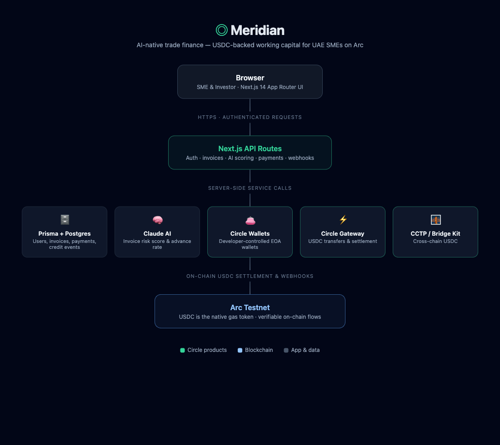

# Meridian

**The AI-native trade finance network giving UAE SMEs instant USDC-backed capital — and building the on-chain credit reputation that earns them better terms on every future transaction.**

> Stablecoin Commerce Stack Challenge · Track 2: SME Trade Finance & Working Capital  
> Built on Circle's developer stack and Arc L1 blockchain

---

## Live Demo

**App:** `https://meridian-finance.vercel.app` ← replace with your Vercel URL  
**Demo video:** `https://loom.com/...` ← replace with your Loom link  
**Demo autopilot:** Visit `/demo` on the live app — one click runs the full lifecycle

---

## The Problem

UAE SMEs represent 53% of national GDP but receive less than 5% of bank credit. An unpaid invoice worth $10,000 due in 90 days represents real working capital a business cannot access. Traditional invoice factoring takes weeks, requires mountains of paperwork, and excludes businesses with no credit history.

**Meridian solves this in under 5 minutes — entirely on-chain.**

---

## What Meridian Does

1. **SME submits an invoice** — drag-and-drop a PDF, Claude AI auto-fills all fields in seconds
2. **AI scores the risk** — Claude assesses the invoice, buyer, and SME track record; assigns a risk score (0–100) and advance rate (up to 90%)
3. **Buyer countersigns** — a magic-link email verifies the buyer acknowledges the debt, preventing fake invoice fraud
4. **Investor funds from the marketplace** — USDC is disbursed to the SME via Circle Wallets in seconds, not days
5. **Settlement waterfall executes automatically** — when the buyer pays, Circle Gateway routes: investor principal + yield returned, platform fee collected, all in USDC on Arc
6. **Credit Passport strengthens** — every settled invoice adds verified trade events to the SME's on-chain credit identity, unlocking better rates on future transactions

---

## Architecture

```
┌─────────────────────────────────────────────────────────────────────┐
│                          MERIDIAN PLATFORM                          │
├───────────────────┬─────────────────────────┬───────────────────────┤
│   NEXT.JS 14      │     CIRCLE STACK         │     AI LAYER          │
│   (App Router)    │                          │                       │
│                   │  • USDC (primary rail)   │  • Claude AI          │
│  • TypeScript     │  • Circle Wallets        │    (invoice parsing)  │
│  • Tailwind CSS   │    (SME + escrow accts)  │  • Risk scoring       │
│  • Prisma ORM     │  • Circle Gateway        │  • Credit analysis    │
│  • NextAuth.js    │    (settlement waterfall)│                       │
│  • Framer Motion  │  • CCTP + Bridge Kit     │                       │
│                   │    (cross-chain demo)    │                       │
├───────────────────┼─────────────────────────┼───────────────────────┤
│   DATABASE        │    BLOCKCHAIN            │     REAL-TIME         │
│                   │                          │                       │
│  • PostgreSQL     │  • Arc Testnet (L1)      │  • Circle Webhooks    │
│  • Supabase       │  • USDC on-chain         │  • Server-Sent Events │
│  • PgBouncer      │  • Nanopayments          │  • Live balance sync  │
│    (pooling)      │    (streaming fees)      │                       │
└───────────────────┴─────────────────────────┴───────────────────────┘
```



---

## Circle Products Used

| Product | How Meridian Uses It |
|---|---|
| **USDC** | Primary settlement rail for all advances, repayments, fees, and yield distribution |
| **Circle Wallets** (Developer-Controlled) | Every SME and investor gets a programmable wallet on Arc. Dedicated escrow wallets are created per invoice. |
| **Circle Gateway** | Orchestrates the multi-party settlement waterfall — routes principal back to investors, fees to platform, on invoice repayment |
| **CCTP + Bridge Kit** | Cross-border demo: USDC transfer from Arc testnet to other supported chains, showcasing UAE → Global payment corridors |
| **Nanopayments** | Per-second factoring fee streams from the moment an invoice is funded — a live ticker shows accruing fees in real time |

---

## Key Features

- **AI Invoice Parser** — PDF drop → Claude Vision extracts all fields automatically
- **Dual-signature fraud prevention** — buyer countersigns via email magic link before invoice can be funded
- **KYB Verification** — UAE Trade License, Commercial Registration, document upload — full KYC flow with investor-visible "Verified Business" badge
- **Real-time UI** — Circle webhook → SSE → wallet balances update live without page refresh
- **Streaming Nanopayments fee** — per-second factoring fee with live counter
- **On-chain Credit Passport** — verifiable trade history, repayment score, investor trust rating
- **Demo Autopilot** — one button runs the full lifecycle with real Circle API calls
- **Arabic / English** — full RTL Arabic support with one-click toggle
- **Production hardened** — idempotency keys, atomic transactions, rate limiting, webhook deduplication, Sentry error tracking, security headers

---

## Tech Stack

| Layer | Technology |
|---|---|
| Framework | Next.js 14 (App Router) |
| Language | TypeScript (strict) |
| Styling | Tailwind CSS + custom design system |
| Fonts | Sora (display) · Inter (body) · Space Grotesk (numbers) |
| Database | PostgreSQL via Supabase |
| ORM | Prisma 5 |
| Auth | NextAuth.js (credentials) |
| Blockchain | Circle Developer-Controlled Wallets on Arc Testnet |
| AI | Claude claude-opus-4-8 via Anthropic SDK |
| Real-time | Server-Sent Events (SSE) |
| Charts | Recharts |
| Animation | Framer Motion |
| Rate Limiting | Upstash Redis |
| Error Tracking | Sentry |
| Deployment | Vercel |

---

## Local Setup

### Prerequisites
- Node.js 18+
- PostgreSQL database (Supabase free tier recommended)
- Circle developer account: [console.circle.com](https://console.circle.com)
- Anthropic API key: [console.anthropic.com](https://console.anthropic.com)
- Upstash Redis (free tier): [upstash.com](https://upstash.com)

### 1. Clone and install

```bash
git clone https://github.com/cybort360/meridian.git
cd meridian
npm install
```

### 2. Environment variables

Copy `.env.example` to `.env.local` and fill in all values:

```bash
cp .env.example .env.local
```

See `.env.example` for all required variables with descriptions.

**Critical notes:**
- `DATABASE_URL` must use your Supabase **connection pooler** URL (port **6543**), not the direct connection (port 5432)
- `CIRCLE_ENTITY_SECRET` is generated once in the Circle console under Developer Settings
- `CIRCLE_WALLET_SET_ID` is created by running the wallet set setup script (see step 4)

### 3. Database setup

```bash
npx prisma migrate deploy
npx prisma generate
```

### 4. Circle wallet set setup

Run this once to create your entity's wallet set on Arc testnet:

```bash
npm run circle:setup
```

Copy the printed `walletSetId` into your `.env.local` as `CIRCLE_WALLET_SET_ID`.

### 5. Seed demo data

```bash
npx prisma db seed
```

This creates four demo accounts — all with password `password123`:

| Role | Email | Company |
|---|---|---|
| SME | `sme@meridian.test` | Gulf Cargo LLC |
| SME | `sme2@meridian.test` | Desert Rose Trading FZE |
| Investor | `investor@meridian.test` | Meridian Capital |
| Admin | `admin@meridian.test` | — |

And eight pre-built invoices across the two verified SMEs in various states (6 SCORED in the marketplace, 1 ACTIVE, 1 SETTLED).

### 6. Run locally

```bash
npm run dev
```

Open [http://localhost:3000](http://localhost:3000)

---

## Arc Testnet Setup

All transactions run on Arc testnet. To fund a wallet with testnet USDC:

1. Log in and go to `/wallet`
2. Copy your Arc wallet address
3. Use the Arc testnet faucet: [docs.arc.network](https://docs.arc.network) → Faucet
4. Request testnet USDC — balance appears within ~30 seconds

---

## Running the Demo

The fastest way to see the full platform:

1. Visit `/demo` on the live app
2. Click **"Run Demo"**
3. Watch the full invoice lifecycle execute automatically with real Circle API calls:
   - SME onboarding → invoice creation → AI scoring → investor funding → settlement → credit passport update

Total time: ~10 seconds on Arc testnet.

---

## Project Structure

```
meridian/
├── src/
│   ├── app/                  # Next.js App Router pages + API routes
│   │   ├── (auth)/           # Login, Register
│   │   ├── (dashboard)/      # All protected pages
│   │   │   ├── dashboard/    # Finance Hub — main overview
│   │   │   ├── invoices/     # Invoice management
│   │   │   ├── marketplace/  # Investor invoice browsing
│   │   │   ├── wallet/       # Circle wallet + CCTP demo
│   │   │   ├── passport/     # On-chain credit passport
│   │   │   └── settings/     # Profile, API config
│   │   └── api/              # All API routes
│   ├── components/           # Reusable UI components
│   ├── lib/
│   │   ├── circle/           # Circle SDK wrappers
│   │   ├── ai/               # Claude risk scoring
│   │   ├── utils/            # USDC math, formatting, validation
│   │   └── rateLimit.ts      # Upstash rate limiters
│   └── types/                # TypeScript type definitions
├── prisma/
│   ├── schema.prisma         # Full data model
│   └── seed.ts               # Demo data
├── public/
│   └── architecture-diagram.png
├── CIRCLE_PRODUCT_FEEDBACK.md
└── .env.example
```

---

## API Routes Reference

| Method | Route | Description |
|---|---|---|
| POST | `/api/auth/register` | Create SME or Investor account + Circle wallet |
| GET | `/api/wallets/balance` | USDC balance from Circle |
| GET | `/api/wallets/transactions` | Payment history |
| POST | `/api/invoices` | Create invoice + trigger AI scoring |
| GET | `/api/invoices` | List invoices for current user |
| POST | `/api/invoices/[id]/fund` | Investor funds invoice (atomic) |
| POST | `/api/invoices/[id]/settle` | Trigger repayment waterfall |
| POST | `/api/invoices/parse-pdf` | AI PDF invoice parser |
| POST | `/api/ai/score` | Claude risk assessment |
| POST | `/api/kyc/submit` | KYB verification submission |
| POST | `/api/payments/cctp` | Cross-chain USDC transfer demo |
| GET | `/api/sse` | Server-Sent Events for real-time updates |
| POST | `/api/webhooks/circle` | Circle webhook handler |
| GET | `/api/health` | Health check |
| POST | `/api/demo/run` | Demo autopilot trigger |

---

## Security

- All financial operations use **idempotency keys** — duplicate requests are safe
- **Atomic transactions** — database and Circle state stay in sync
- **Rate limiting** on auth (5/15min per email) and payment routes (10/hr per IP) via Upstash Redis
- **Webhook deduplication** — Circle events processed exactly once
- **Input sanitization** on all user-submitted text (DOMPurify) — XSS prevention
- **Security headers** — full CSP, X-Frame-Options, X-Content-Type-Options
- **Sentry** error tracking on all API routes

---

## Hackathon Submission

**Competition:** Stablecoin Commerce Stack Challenge  
**Track:** Track 2 — Best SME Trade Finance & Working Capital Workflow  
**Organizer:** Ignyte Challenges  
**Technical Sponsors:** Circle, Arc

---

## License

Non-exclusive license granted to Ignyte Challenges per competition rules.  
All code and product design © 2026 the submitter. All rights reserved.

---

## Development

Built with [Claude Code](https://claude.ai/code) (Anthropic) under an active Anthropic subscription.  
All architecture decisions, product design, and code are original work by the submitter.
